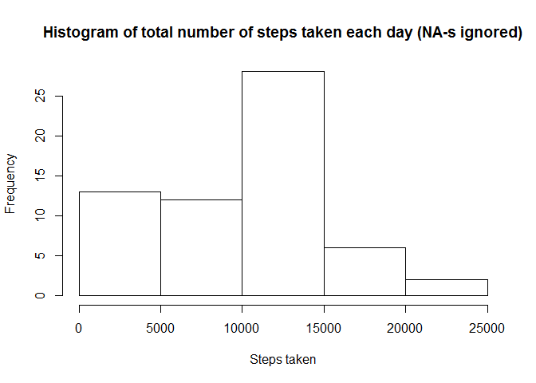
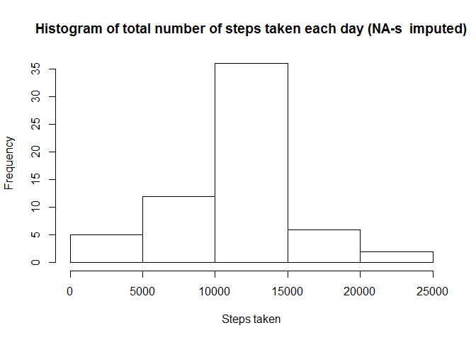
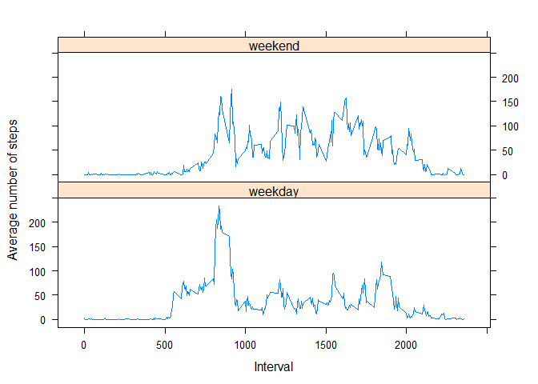

# Reproducible Research: Peer Assessment 1


## Loading and preprocessing the data

Show any code that is needed to

1. Load the data (i.e. read.csv())

```r
unzip("activity.zip")
data <- read.csv("activity.csv")
```

2. Process/transform the data (if necessary) into a format suitable for your analysis


```r
#transform dates to date format
data$date <- as.Date(data$date, format="%Y-%m-%d")
```

## What is mean total number of steps taken per day?

For this part of the assignment, you can ignore the missing values in the dataset.

1. Make a histogram of the total number of steps taken each day


```r
library(dplyr)
summaryByDate <- data %>% 
        group_by(date) %>% 
        summarize(sumSteps = sum(steps, na.rm = TRUE))
hist(summaryByDate$sumSteps, main="Histogram of total number of steps taken each day (NA-s ignored)", 
     xlab = "Steps taken")
```

 

2. Calculate and report the mean and median total number of steps taken per day


```r
#mean
mean(summaryByDate$sumSteps)
```

```
## [1] 9354.23
```

```r
#median
median(summaryByDate$sumSteps)
```

```
## [1] 10395
```


## What is the average daily activity pattern?

1. Make a time series plot (i.e. type = "l") of the 5-minute interval (x-axis) and the average number of steps taken, averaged across all days (y-axis)


```r
summaryByInterval <- data %>% 
        group_by(interval) %>% 
        summarize(avSteps = mean(steps, na.rm = TRUE))
plot(summaryByInterval$interval, summaryByInterval$avSteps, type = "l", 
     main = "Average daily activity pattern", xlab = "Interval", ylab = "Average steps")
```

 

2. Which 5-minute interval, on average across all the days in the dataset, contains the maximum number of steps?


```r
summaryByInterval[summaryByInterval$avSteps == max(summaryByInterval$avSteps), 1]
```

```
## Source: local data frame [1 x 1]
## 
##   interval
## 1      835
```

Interval 835.

## Imputing missing values

Note that there are a number of days/intervals where there are missing values (coded as NA). The presence of missing days may introduce bias into some calculations or summaries of the data.

1. Calculate and report the total number of missing values in the dataset (i.e. the total number of rows with NAs)


```r
sum(is.na(data$steps))
```

```
## [1] 2304
```
Total number of missing values is 2304.

2. Devise a strategy for filling in all of the missing values in the dataset. The strategy does not need to be sophisticated. For example, you could use the mean/median for that day, or the mean for that 5-minute interval, etc.

Missing values will be replaced by mean for that 5-minute interval.

3. Create a new dataset that is equal to the original dataset but with the missing data filled in.


```r
dataNew <- data %>% group_by(interval) %>% mutate(steps = ifelse(is.na(steps), mean(steps, na.rm=TRUE), steps))
```

4. Make a histogram of the total number of steps taken each day and Calculate and report the mean and median total number of steps taken per day. Do these values differ from the estimates from the first part of the assignment? What is the impact of imputing missing data on the estimates of the total daily number of steps?


```r
summaryByDateNew <- dataNew %>% 
        group_by(date) %>% 
        summarize(sumSteps = sum(steps))
hist(summaryByDateNew$sumSteps, main="Histogram of total number of steps taken each day (NA-s  imputed)", 
     xlab = "Steps taken")
```

 

```r
#mean
mean(summaryByDateNew$sumSteps)
```

```
## [1] 10766.19
```

```r
#median
median(summaryByDateNew$sumSteps)
```

```
## [1] 10766.19
```
Inpact of inputing missing data raises total number of steps. This is expected as we have more numbers in sum.

## Are there differences in activity patterns between weekdays and weekends?

1. Create a new factor variable in the dataset with two levels -- "weekday" and "weekend" indicating whether a given date is a weekday or weekend day.


```r
data <- data %>% mutate(day = ifelse(as.POSIXlt(date)$wday %in% c(0,6), "weekend", "weekday")) %>% transform(day = factor(day))
```

2. Make a panel plot containing a time series plot (i.e. type = "l") of the 5-minute interval (x-axis) and the average number of steps taken, averaged across all weekday days or weekend days (y-axis).


```r
summaryByInterval <- data %>% 
        group_by(day, interval) %>% 
        summarize(avSteps = mean(steps, na.rm = TRUE))
library(lattice)
xyplot(avSteps ~ interval | day, data = summaryByInterval, layout = c(1,2), type = "l",
       xlab = "Interval", ylab = "Average number of steps")
```

 
